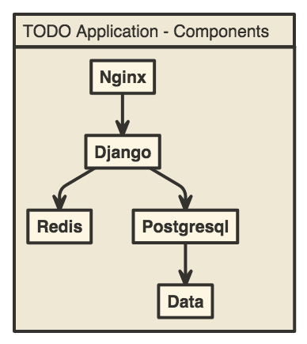

# TODO Application

This is a Web application of TODO made in [Django](https://www.djangoproject.com/) and configured with [docker-compose](https://docs.docker.com/compose/)

## Guides

- [Docker Compose Django](https://docs.docker.com/compose/django/)

## Components

---

Created with :heart: by [yoelfme](https://twitter.com/yoelfme)
